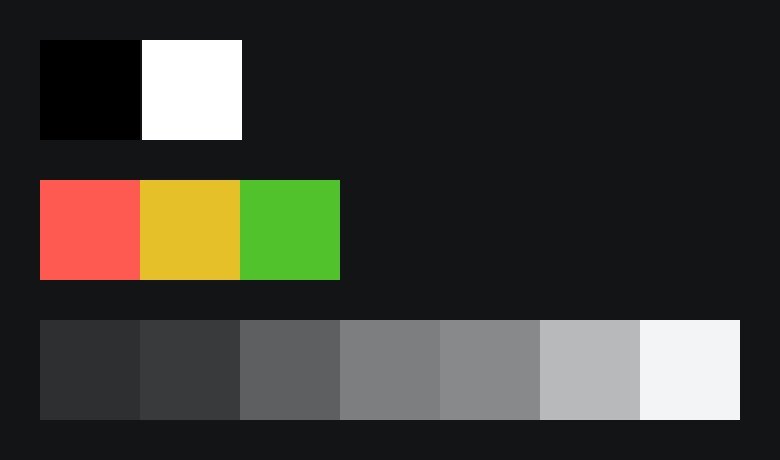
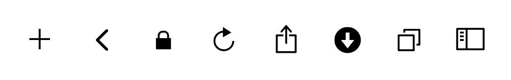
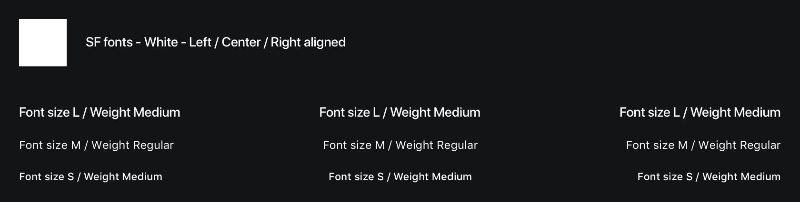
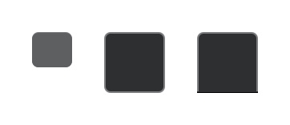
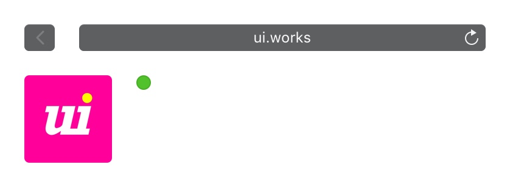
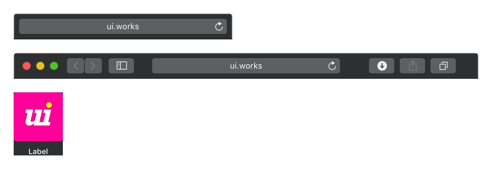
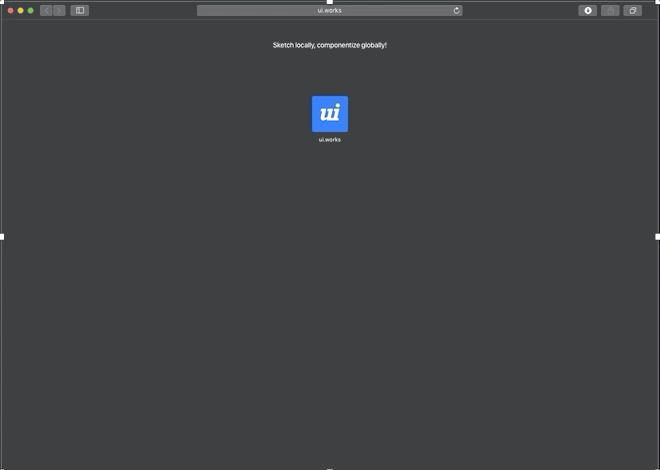

## Table of contents
* [General info](#general-info)
* [Technologies](#technologies)
* [Content](#content)
* [Setup](#setup)
* [Status](#status)

## General info
This project started as a simple sketch helper library for a responsive browser bar that can be used in design mock-ups. It soon started serving another purpose for demonstrating a scalable sketch library set up, as it further separates the components of the browser bar into dedicated libraries.
	
## Technologies
Project is created with:
* Sketch version: 57.1

## Content

### Colors

`libs/library-colors.sketch`

---

### Icons

`libs/library-icons.sketch`

---

### Fonts

`libs/library-font-system.sketch`

---

### Components

`libs/library-components.sketch`

| Constructors |
|:--- |
|  |

| Components |
|:--- |
|  |

| Pre-compositions |
|:--- |
|  |

---

### Composition

`/composition.sketch`

---

## Setup
Clone this repository or download the zipped file.

## Status

In development.